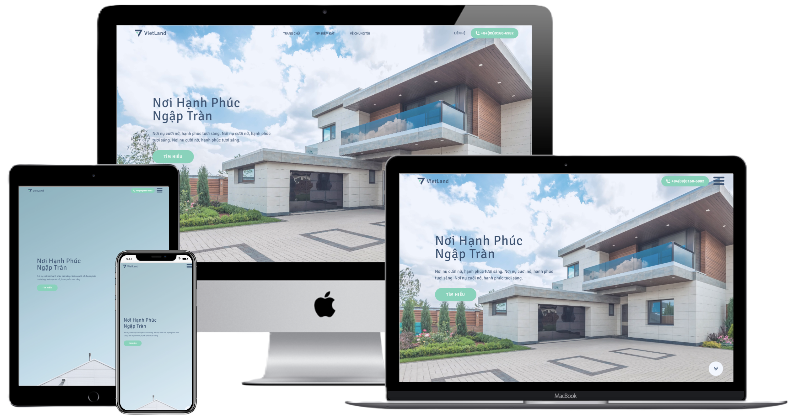

#  [VietLand - Real Estate App][vietland]



> A web application that blends modern design approaches with a timeless and intuitive UI, designed and developed exclusively for the local small-scale real estate business.

[vietland]: https://viet-land.vn/ "Viet Land App"

[](https://app.netlify.com/sites/viet-land/deploys)

The main objective of this project is to help the local business establish a strong connection with potential customers and create an outstanding first impression, ultimately giving the business a distinct advantage amidst the fiercely demanding marketplace.

Initial constraints that we needed to address:

- user-friendly design with an understanding of local language and cultural distinctiveness
- competitive performance on mobile devices
- smooth delivery and uncomplicated content management processes
- **restricted budget**

In this particular scenario, the approach taken was to generate static pages rather than rely on client-side or server-side rendering. The client-side rendering was ruled off due to the significance placed on mobile performance and search engine optimization (SEO). Meanwhile, the idea of spending on the development/hosting/management of the backend side ruled off the server-side rendering approach as well. Instead of overinvesting in the backend infrastructure, we choose the services of the headless CMS (with generous free tiers).

And, although static pages sound … lifeless, the app pages have been designed in a manner that does not give off a static impression entirely! The secret is the usage of component-based islands of JS interactivity whenever necessary.

[**View Viet Land App (Live)**][vietland]

## Key Features

- Mobile-first responsive design

- Forms with intuitive UI

- Interactive search

- Responsive map

- Integration with Contentful CMS

## Designed with and Build with

This project was developed by selecting a carefully curated set of modern technologies and tools. The pivotal ones are listed below. For a comprehensive view of all dependencies, including exact versions, feel free to explore the details in the [package.json](https://github.com/AnnaBurd/web-real-estate/blob/main/package.json) file.

| Name                                                                                                                                                   | Usage                                                                                                             |
| ------------------------------------------------------------------------------------------------------------------------------------------------------ | ----------------------------------------------------------------------------------------------------------------- |
| [](https://astro.build/)                           | Leveraged for generating static pages, emphasizing fast load times and optimal performance.                       |
| [](https://reactjs.org/)                           | Integrated strategically for dynamic content and interactive components, providing a lively user experience.      |
| [](https://www.typescriptlang.org/) | Ensured codebase reliability and scalability, contributing to the overall maintainability of the application.     |
| [](https://www.contentful.com/)     | Served as the headless CMS, facilitating easy content updates and management.                                     |
| [](https://www.figma.com/)                         | Utilized for collaborative design processes, ensuring a cohesive and visually appealing user interface.           |
| [](https://tailwindcss.com/) | Applied for a streamlined and responsive design, enhancing the overall aesthetic and usability.                   |
| [](https://leafletjs.com/)                   | Integrated for interactive maps, enhancing the user experience and providing valuable location-based information. |

## Installation

| Command           | Action                                                                                                                           |
| :---------------- | :------------------------------------------------------------------------------------------------------------------------------- |
| `npm install`     | Installs dependencies                                                                                                            |
| `npm run dev`     | Starts local dev server at `localhost:4321` Note: switched from `localhost:3000` to `localhost:3000` in latest versions of Astro |
| `npm run build`   | Build your production site to `./dist/`                                                                                          |
| `npm run preview` | Preview your build locally, before deploying                                                                                     |

## Project Structure

The project contains the following files and folders:

```
/
+---.github                 - configurations for github actions ci
+---.vscode                 - list of recommended extensions for vscode editor
+---dist                    - files generated by build command
+---node_modules            - third-party libs
+---preview                 - preview assets for md documentation
+---public                  - fonts, images and icons
|
\---src
    |
    +---components          - reusable Astro components
    |
    +---layouts             - common layout for all pages
    |
    +---model               - application data
    |
    +---pages               - file-based routes
    |       404.astro
    |       index.astro
    |       thong-tin.astro
    |       tim-dat.astro
    |       [slug].astro
    |
    +---scripts             - vanilla js (ts) scripts
    |
    \---styles              - css defaults and variables


... ts, prettier, tailwind, astro config files
```

During the build, Astro looks for `.astro` or `.md` files in the `src/pages/` directory. Each page is exposed as a route based on its file name. The `404.astro` page is exposed as the default error page. `[slug].astro` exposes dynamically-generated pages.

Astro components in `src/components/` can include pure Astro or React/Vue/Svelte/Preact components.

## 👀 Want to contribute?

1. Fork project (<https://github.com/AnnaBurd/web-real-estate/fork>)
2. Create your feature branch (`git checkout -b feature/fooBar`)
3. Commit your changes (`git commit -am 'Add some fooBar'`)
4. Push to the branch (`git push origin feature/fooBar`)
5. Create a new Pull Request

[Discuss Issues](https://www.linkedin.com/in/anna-burdanova-b91453218/)
